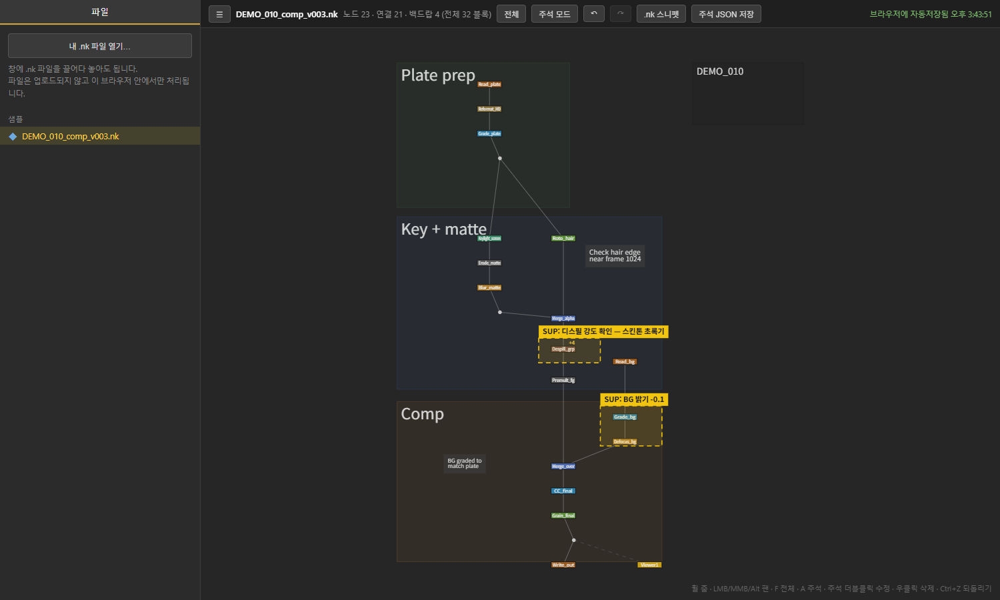
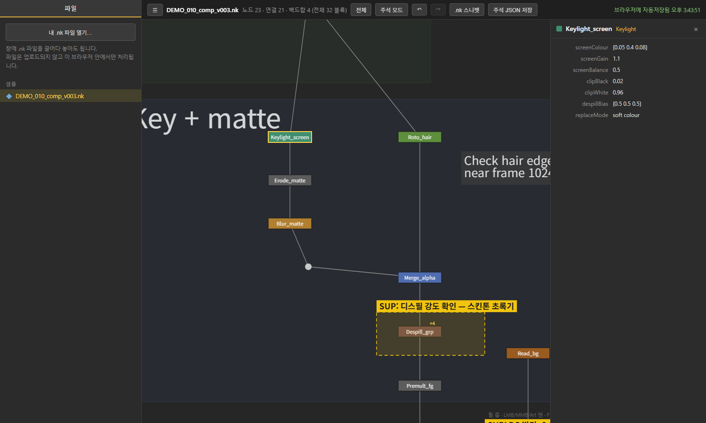

# Nuke Preview App

Preview the node structure of a Nuke `.nk` script in the browser — no Nuke license needed — and leave supervisor notes that show up as backdrops when the artist opens the script.

**Live demo: https://aprilsoda.github.io/nuke-preview-app/** — opens a sample comp; drag your own `.nk` onto the page to view it (parsed locally in your browser, nothing is uploaded).





A `.nk` file is plain text, so it is parsed directly. Parsing a 1.4 MB production comp takes about 20 ms in the browser.

## Two ways to run

| | Static (GitHub Pages / any web host) | Local server (`server.py`) |
| --- | --- | --- |
| Open a file | drag & drop or file picker | browse folders, recents, `?path=` |
| Parsing | in the browser (`nk_parser.js`) | Python (`nk_parser.py`), cached by mtime |
| Annotations | autosaved to browser storage; **Save JSON** button | autosaved next to the `.nk` as a sidecar file |
| Version list + diff | – | yes (`name_v###.nk` siblings) |

The viewer detects which mode it is in automatically: if there is no API server it falls back to static mode.

## Features

- **Fast graph viewer** — dependency-free Canvas renderer, Nuke-style navigation (wheel zoom, LMB/MMB/Alt pan, `F` to fit).
- **Properties panel** — click a node to see the knobs that differ from defaults.
- **Label evaluation** — a small TCL evaluator resolves DAG labels such as `[value root.name]`, `file tail/rootname`, `split/join/lrange/lindex`. Anything it can't evaluate is shown as raw text instead of guessed.
- **Supervisor annotations** — draw a box, type a note. Full undo/redo history (`Ctrl+Z` / `Ctrl+Shift+Z`) that survives closing the browser. The original `.nk` is never modified.
- **Notes reach the artist as backdrops** — a Nuke hook creates yellow `SUP_note*` backdrops from the sidecar file on script load.
- **Version diff** (server mode) — added / removed nodes versus the previous version.

Group / Gizmo contents are collapsed into a single node with an inner-node count badge.

## Run locally

Requires Python 3.9+ (standard library only).

```bash
python server.py 8791
```

Open http://localhost:8791 and pick a file in the sidebar, or open `http://localhost:8791/?path=<absolute path to .nk>`.

Extra browse roots (separated by `;` on Windows, `:` elsewhere):

```bash
NUKE_PREVIEW_ROOTS="D:/projects;E:/shots" python server.py
```

Static mode without Python: open `index.html` through any static file server (or straight from disk).

Parse a single file to JSON:

```bash
python nk_parser.py "path/to/script.nk" out_dir
```

## Nuke hook

Add to your `menu.py` (adjust the path):

```python
nuke.pluginAddPath(r"C:\path\to\nuke-preview-app\nuke_hook")
import annotation_backdrops
```

On script load, notes from `<script>.nk.annotations.json` are synced to `SUP_note*` backdrops (existing ones are updated, deleted notes are removed).

In static mode, click **Save JSON** and put the downloaded `<script>.nk.annotations.json` next to the `.nk` file — the hook picks it up the same way.

## Layout

| File | Purpose |
| --- | --- |
| `index.html` | Single-file viewer and annotation UI |
| `nk_parser.js` | Browser parser (behaves identically to the Python one) |
| `nk_parser.py` | `.nk` text → graph JSON (nodes, edges, backdrops, knobs) |
| `server.py` | Local API: browse, graph (mtime-cached), versions, annotations |
| `nuke_hook/annotation_backdrops.py` | Sidecar notes → BackdropNodes inside Nuke |
| `samples/` | Demo comp used by the live demo |

## Known limits

- Edges are reconstructed from the `push`/`set` stack; unusual scripts may produce a few wrong edges.
- Values that need real render data (e.g. `[metadata ...]`) can't be evaluated.
- The local server has no authentication and binds to `127.0.0.1` only. Don't expose it on a shared network as-is.
- Static-mode annotations live in that browser's storage; use **Save JSON** to keep or share them.
